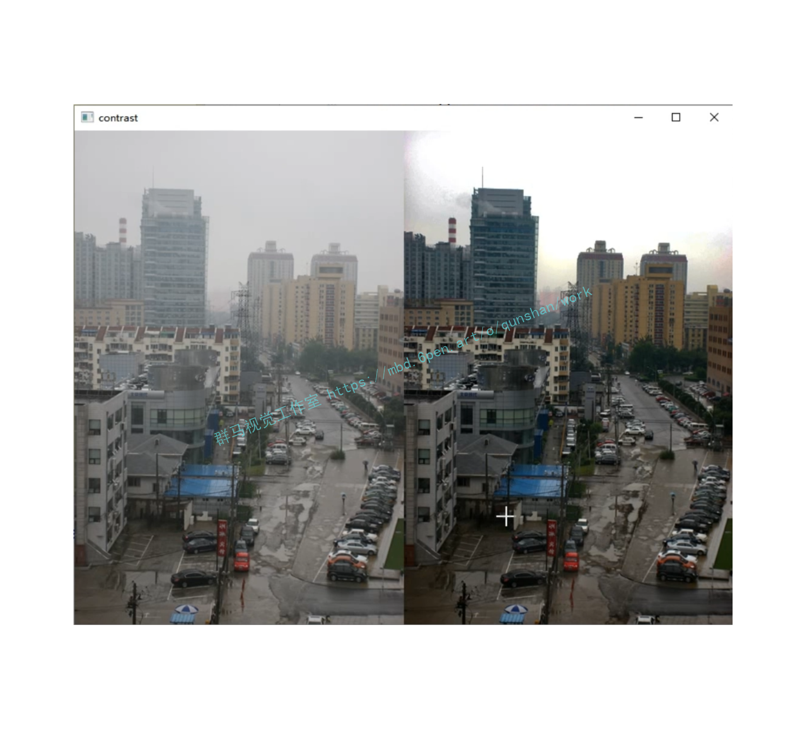
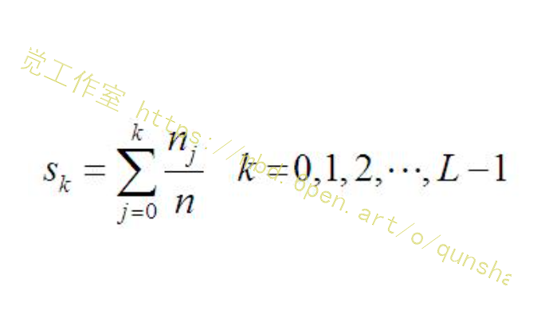
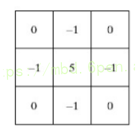
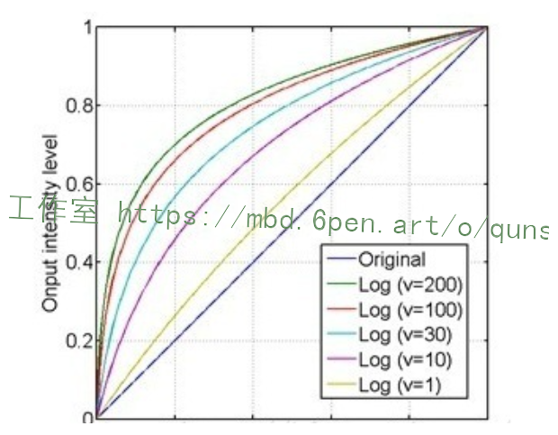
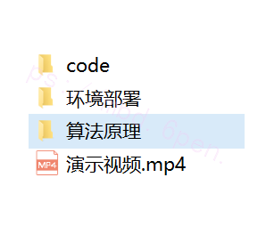


# 1.图片识别



# 2.视频展示
[[项目分享]Python基于OpenCV的图像去雾算法[完整源码＆部署教程]_哔哩哔哩_bilibili](https://www.bilibili.com/video/BV1eB4y1G7dX/?vd_source=bc9aec86d164b67a7004b996143742dc)

# 3.算法原理
[参考该博客图像增强算法](https://mbd.pub/o/bread/Yp6cmZZu)，对图像的亮度、对比度、饱和度、色调等进行调节，增加其清晰度，减少噪点等。图像增强往往经过多个算法的组合，完成上述功能，比如图像去燥等同于低通滤波器，增加清晰度则为高通滤波器，当然增强一副图像是为最后获取图像有用信息服务为主。一般的算法流程可为：图像去燥、增加清晰度（对比度）、灰度化或者获取图像边缘特征或者对图像进行卷积、二值化等，上述四个步骤往往可以通过不同的步骤进行实现，后续将针对此方面内容进行专题实验，列举其应用场景和处理特点。
## 基于直方图均衡化的图像增强
图像对比度增强的方法可以分为两种：直接对比度增强方法，间接对比度增强方法。直方图拉伸和直方图均衡化是常见的间接对比度增强方法。直方图拉伸是利用对比度拉伸对直方图进行调整，扩大前景和背景灰度的差别，这种方法可以通过线性和非线性的方法来实现，其中ps中就是利用此方法提高对比度；直方图均衡化则是利用累积函数对灰度值进行调整，实现对比度的增强。
直方图均衡化处理原理：将原始图像的灰度图从比较集中的某个灰度区间均匀分布在整个灰度空间中，实现对图像的非线性拉伸，重新分配图像像素值。

算法应用场景：
1、算法的本质是重新分布图像的像素值，增加了许多局部的对比度，整体的对比度没有进行太大改变，所以应用图像为图像有用数据的对比度相近是，例如：X光图像，可以将曝光过度或曝光不足照片进行更好的显示，或者是背景及前景太亮或太暗的图像非常有用。
2、算法当然也有缺点，具体表现为：变换后的图像灰度级减少，某些细节减少；某些图像有高峰值，则处理后对比度不自然的过分增强。

算法实现特点：
1、均衡化过程：直方图均衡化保证在图像像素映射过程中原来的大小关系保持不变，即较亮的区域依旧较亮，较暗的依旧较暗，只是对比度增加，不能明暗颠倒；保证像素映射函数的值域在0和255之间。累积分布函数是单增长函数，并且值域是0到1。
2、累积分布函数实现过程：
 比较概率分布函数和累积分布函数，前者的二维图像是参差不齐的，后者是单调递增的。直方图均衡化过程中，映射方法是

其中，n是图像中像素的总和。

## 基于拉普拉斯算子的图像增强
[参考博客](https://afdian.net/item?plan_id=52cb7cde5e6611ed9a4852540025c377)
利用拉普拉斯算子进行图像增强本质是利用图像的二次微分对图像进行蜕化，在图像领域中微分是锐化，积分是模糊，利用二次微分对图像进行蜕化即利用邻域像素提高对比度。在opencv中也有拉普拉斯函数，但那时生成了灰度图像，更多的求取边缘，具体源码还没研究，其中原理可以参考我前一篇文章，针对拉普拉斯有个详细的介绍。


## 基于对象Log变换的图像增强
对数变换可以将图像的低灰度值部分扩展，显示出低灰度部分更多的细节，将其高灰度值部分压缩，减少高灰度值部分的细节，从而达到强调图像低灰度部分的目的。变换方法：
对数变换对图像低灰度部分细节增强的功能过可以从对数图上直观理解：

x轴的0.4大约对应了y轴的0.8，即原图上0~0.4的低灰度部分经过对数运算后扩展到0~0.8的部分，而整个0.4~1的高灰度部分被投影到只有0.8~1的区间，这样就达到了扩展和增强低灰度部分，压缩高灰度部分的值的功能。

从上图还可以看到，对于不同的底数，底数越大，对低灰度部分的扩展就越强，对高灰度部分的压缩也就越强。

# 4.代码实现
```
# 图像增强算法，图像锐化算法
# 1）基于直方图均衡化 2）基于拉普拉斯算子 3）基于对数变换 4）基于伽马变换 5)CLAHE 6)retinex-SSR 7)retinex-MSR
# 其中，基于拉普拉斯算子的图像增强为利用空域卷积运算实现滤波
# 基于同一图像对比增强效果
# 直方图均衡化:对比度较低的图像适合使用直方图均衡化方法来增强图像细节
# 拉普拉斯算子可以增强局部的图像对比度
# log对数变换对于整体对比度偏低并且灰度值偏低的图像增强效果较好
# 伽马变换对于图像对比度偏低，并且整体亮度值偏高（对于相机过曝）情况下的图像增强效果明显

import cv2
import numpy as np
import matplotlib.pyplot as plt


# 直方图均衡增强
def hist(image):
    r, g, b = cv2.split(image)
    r1 = cv2.equalizeHist(r)
    g1 = cv2.equalizeHist(g)
    b1 = cv2.equalizeHist(b)
    image_equal_clo = cv2.merge([r1, g1, b1])
    return image_equal_clo


# 拉普拉斯算子
def laplacian(image):
    kernel = np.array([[0, -1, 0], [-1, 5, -1], [0, -1, 0]])
    image_lap = cv2.filter2D(image, cv2.CV_8UC3, kernel)
    return image_lap


# 对数变换
def log(image):
    image_log = np.uint8(np.log(np.array(image) + 1))
    cv2.normalize(image_log, image_log, 0, 255, cv2.NORM_MINMAX)
    # 转换成8bit图像显示
    cv2.convertScaleAbs(image_log, image_log)
    return image_log


# 伽马变换
def gamma(image):
    fgamma = 2
    image_gamma = np.uint8(np.power((np.array(image) / 255.0), fgamma) * 255.0)
    cv2.normalize(image_gamma, image_gamma, 0, 255, cv2.NORM_MINMAX)
    cv2.convertScaleAbs(image_gamma, image_gamma)
    return image_gamma


# 限制对比度自适应直方图均衡化CLAHE
def clahe(image):
    b, g, r = cv2.split(image)
    clahe = cv2.createCLAHE(clipLimit=2.0, tileGridSize=(8, 8))
    b = clahe.apply(b)
    g = clahe.apply(g)
    r = clahe.apply(r)
    image_clahe = cv2.merge([b, g, r])
    return image_clahe


def replaceZeroes(data):
    min_nonzero = min(data[np.nonzero(data)])
    data[data == 0] = min_nonzero
    return data


# retinex SSR
def SSR(src_img, size):
    L_blur = cv2.GaussianBlur(src_img, (size, size), 0)
    img = replaceZeroes(src_img)
    L_blur = replaceZeroes(L_blur)

    dst_Img = cv2.log(img/255.0)
    dst_Lblur = cv2.log(L_blur/255.0)
    dst_IxL = cv2.multiply(dst_Img, dst_Lblur)
    log_R = cv2.subtract(dst_Img, dst_IxL)

    dst_R = cv2.normalize(log_R,None, 0, 255, cv2.NORM_MINMAX)
    log_uint8 = cv2.convertScaleAbs(dst_R)
    return log_uint8


def SSR_image(image):
    size = 3
    b_gray, g_gray, r_gray = cv2.split(image)
    b_gray = SSR(b_gray, size)
    g_gray = SSR(g_gray, size)
    r_gray = SSR(r_gray, size)
    result = cv2.merge([b_gray, g_gray, r_gray])
    return result


# retinex MMR
def MSR(img, scales):
    weight = 1 / 3.0
    scales_size = len(scales)
    h, w = img.shape[:2]
    log_R = np.zeros((h, w), dtype=np.float32)

    for i in range(scales_size):
        img = replaceZeroes(img)
        L_blur = cv2.GaussianBlur(img, (scales[i], scales[i]), 0)
        L_blur = replaceZeroes(L_blur)
        dst_Img = cv2.log(img/255.0)
        dst_Lblur = cv2.log(L_blur/255.0)
        dst_Ixl = cv2.multiply(dst_Img, dst_Lblur)
        log_R += weight * cv2.subtract(dst_Img, dst_Ixl)

    dst_R = cv2.normalize(log_R,None, 0, 255, cv2.NORM_MINMAX)
    log_uint8 = cv2.convertScaleAbs(dst_R)
    return log_uint8


def MSR_image(image):
    scales = [15, 101, 301]  # [3,5,9]
    b_gray, g_gray, r_gray = cv2.split(image)
    b_gray = MSR(b_gray, scales)
    g_gray = MSR(g_gray, scales)
    r_gray = MSR(r_gray, scales)
    result = cv2.merge([b_gray, g_gray, r_gray])
    return result


if __name__ == "__main__":
    image = cv2.imread("example.jpg")
    image_gray = cv2.cvtColor(image, cv2.COLOR_BGR2GRAY)

    plt.subplot(4, 2, 1)
    plt.imshow(image)
    plt.axis('off')
    plt.title('Offical')

    # 直方图均衡增强
    image_equal_clo = hist(image)

    plt.subplot(4, 2, 2)
    plt.imshow(image_equal_clo)
    plt.axis('off')
    plt.title('equal_enhance')

    # 拉普拉斯算法增强
    image_lap = laplacian(image)

    plt.subplot(4, 2, 3)
    plt.imshow(image_lap)
    plt.axis('off')
    plt.title('laplacian_enhance')

    # LoG对象算法增强
    image_log = log(image)

    plt.subplot(4, 2, 4)
    plt.imshow(image_log)
    plt.axis('off')
    plt.title('log_enhance')

    # 伽马变换
    image_gamma = gamma(image)

    plt.subplot(4, 2, 5)
    plt.imshow(image_gamma)
    plt.axis('off')
    plt.title('gamma_enhance')

    # CLAHE
    image_clahe = clahe(image)

    plt.subplot(4, 2, 6)
    plt.imshow(image_clahe)
    plt.axis('off')
    plt.title('CLAHE')

    # retinex_ssr
    image_ssr = SSR_image(image)

    plt.subplot(4, 2, 7)
    plt.imshow(image_ssr)
    plt.axis('off')
    plt.title('SSR')

    # retinex_msr
    image_msr = MSR_image(image)

    plt.subplot(4, 2, 8)
    plt.imshow(image_msr)
    plt.axis('off')
    plt.title('MSR')

    plt.show()

```
# 5.系统整合
下图[完整源码&环境部署视频教程&算法原理](https://s.xiaocichang.com/s/8459b9)


参考博客[《Python基于OpenCV的图像去雾算法\[完整源码＆部署教程\]》](https://mbd.pub/o/qunma/work)


# 6.参考文献
1、2008,Single image dehazing,R. Fattal,ACM Transactions on Graphics.
***
2、2014,Efficient Image Dehazing with Boundary Constraint and Contextual Regularization, G. Meng, Y. Wang, J. Duan, S. Xiang and C. Pan,ICCV         
***
3、2016,Non-local image dehazing,D. Berman, T. Treibitz and S. Avidan, CVPR.
***
4、2009,Single image haze removal using dark channel prior,K. He, J. Sun and X. Tang,CVPR.
***
5、2017,Single Image Dehazing Based on the Physical Model and MSRCR Algorithm,J. B. Wang, K. Lu, J. Xue, N. He and L. Shao,TCSVT
***
6、2013,Hardware Implementation of a Fast and Efficient Haze Removal Method,Y. H. Shiau, H. Y. Yang, P. Y. Chen and Y. Z. Chuang,TCSVT
***
7、2014,Visibility Restoration of Single Hazy Images Captured in Real-World Weather Conditions，S. C. Huang, B. H. Chen and W. J. Wang,TCSVT
***
8、2015,Single image dehazing with a physical model and dark channel prior,J. B. Wang, N. He, L. L. Zhang and K. Lu,Neurocomputing
***
9、2017,An Efficient Fusion-Based Defogging,J. M. Guo,  J. Y. Syue, V. R. Radzicki and H. Lee,Tip
***
10、2017,Haze Removal Using the Difference-Structure-Preservation Prior,L. Y He, J. Z. Zhao, N. N. Zheng and D.Y. Bi,TIP      


---
#### 如果您需要更详细的【源码和环境部署教程】，除了通过【系统整合】小节的链接获取之外，还可以通过邮箱以下途径获取:
#### 1.请先在GitHub上为该项目点赞（Star），编辑一封邮件，附上点赞的截图、项目的中文描述概述（About）以及您的用途需求，发送到我们的邮箱
#### sharecode@yeah.net
#### 2.我们收到邮件后会定期根据邮件的接收顺序将【完整源码和环境部署教程】发送到您的邮箱。
#### 【免责声明】本文来源于用户投稿，如果侵犯任何第三方的合法权益，可通过邮箱联系删除。